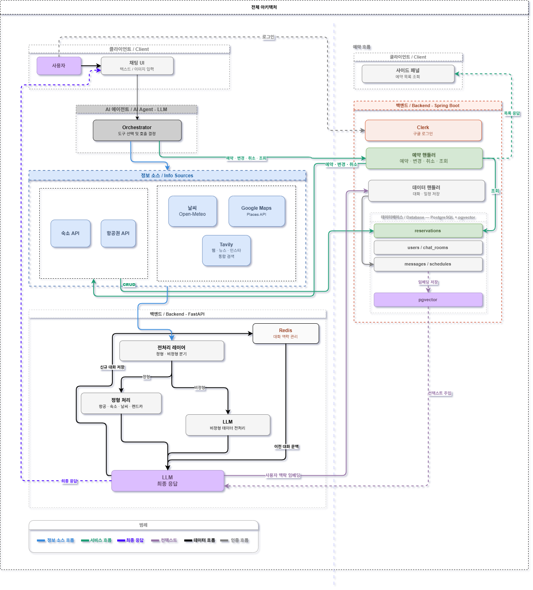
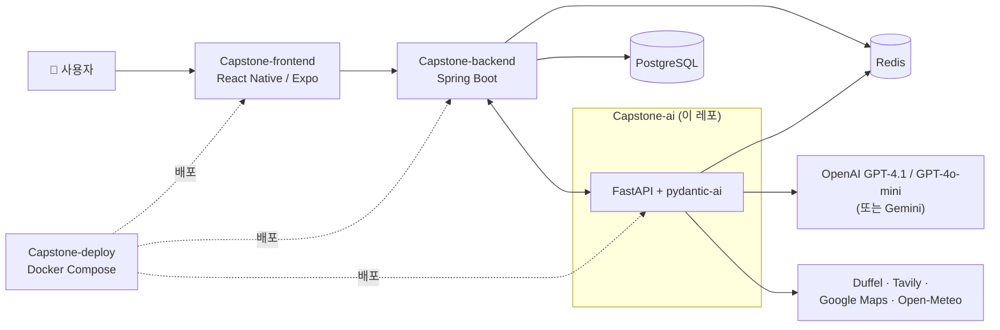

# 📍 마실 (Masil) — AI Agent Server

> **대화형 실시간 정보 기반 여행 일정 생성 및 예약 서비스**

**마실**은 정적이고 파편화된 기존 여행 정보 서비스의 한계와, 생성형 AI의 고질적 문제인 환각(Hallucination)을 극복하기 위한 서비스입니다. 실시간 데이터를 동적으로 결합해 신뢰할 수 있는 여행 가이드를 제공하고, 정보 탐색부터 일정 계획, 실제 예약까지 하나의 대화형 인터페이스 안에서 끝맺는 것을 목표로 합니다.

이 레포는 마실의 4개 서비스 중 **AI 에이전트 서버**로, 사용자 대화를 해석해 외부 API(항공/숙소/지도/날씨/웹 검색)를 조합하고 구조화된 일정·변경·예약 결과를 백엔드로 전달하는 역할을 담당합니다.



---

## 👥 팀 (4조 · 여울)

명지대학교 컴퓨터공학전공 캡스톤디자인 (지도교수: 안희철)

| | 역할 | 이름 | GitHub |
| :---: | :--- | :--- | :--- |
|  | 팀장 | 박지후 | [@thisisjihoo](https://github.com/thisisjihoo) |
|  | 팀원 | 임채현 | [@Chaehyunli](https://github.com/Chaehyunli) |
|  | 팀원 | 김한슬 | [@hanseul377](https://github.com/hanseul377) |
|  | 팀원 | 남서현 | [@DOOYEE0709](https://github.com/DOOYEE0709) |

---

## 🧭 핵심 기능

- **대화형 일정 생성** — 자연어 요청을 목적지·기간·인원 등이 반영된 `day_plans` 구조화 일정으로 변환
- **실시간 도구 호출 (Tool Calling)** — 항공권/숙소 검색, 실시간 날씨, 장소·경로 검색, 웹 검색을 대화 중 자동 호출
- **일정 부분 수정** — 기존 일정 중 일부만 자연어로 변경 요청 시 해당 항목만 패치
- **예약/취소 처리** — 사용자가 요청한 예약·취소를 구조화된 데이터로 변환해 백엔드에 전달
- **대화 컨텍스트 유지** — Redis 기반 대화 요약 + pgvector 유사 메시지 검색으로 이전 맥락 반영
- **멀티 LLM 프로바이더** — OpenAI ↔ Gemini를 환경 변수만으로 전환 가능한 구조

---

## 🏗 시스템 아키텍처



Spring Boot 백엔드가 사용자 요청을 받아 이 AI 서버로 위임하면, 오케스트레이터 에이전트가 상황에 맞는 도구를 선택·호출해 응답(대화/일정/변경/예약/취소)을 구조화된 형태로 반환합니다.

---

## 🛠 Tech Stack

### **Backend & Framework**
* **Language:** Python 3.12+
* **Framework:** **FastAPI** (Async, 고성능)
* **Environment:** Pydantic Settings (`.env` 기반 타입 세이프 설정)
* **Server:** Uvicorn

### **AI & LLM Strategy**
* **Orchestration:** **pydantic-ai** (타입 안전한 Tool 정의, Agent, RunContext)
* **Core Model (기본값):** **OpenAI `gpt-4.1`**(오케스트레이터) + **`gpt-4o-mini`**(비정형 전처리/타입 판별) — 역할별 모델 분리
* **대체 프로바이더:** `.env`에서 `LLM_PROVIDER=gemini`로 전환 시 `gemini-2.5-pro` / `gemini-2.0-flash` 사용 (`ORCHESTRATOR_MODEL`, `PREPROCESSOR_MODEL`로 개별 지정도 가능)
* **Embedding:** OpenAI `text-embedding-3-small` (대화 메시지 벡터화 → pgvector 유사도 검색)
* **Observability:** **LangSmith** (선택, LLM 추론 과정 추적 및 레이턴시 모니터링)

| 모델 ID | 역할 | 제공자 |
| :--- | :--- | :--- |
| `gpt-4.1` | 오케스트레이터 — 최종 응답 생성 및 Tool 호출 | OpenAI (기본) |
| `gpt-4o-mini` | 전처리 — 비정형 응답 타입 판별 | OpenAI (기본) |
| `gemini-2.5-pro` / `gemini-2.0-flash` | 위 두 역할의 대체 모델 | Gemini (`LLM_PROVIDER=gemini`) |

### **Database & Infrastructure**
* **Database:** PostgreSQL + pgvector (Supabase) — 사용자 정보, 일정, 대화 임베딩 저장
* **Cache/Memory:** Redis (Upstash) — 대화 맥락(Conversation Summary) 관리

---

## 🔧 연동 외부 API / Agent Tools

오케스트레이터에는 총 12개의 도구가 등록되어 있습니다. 자세한 입출력 규격은 [`docs/agent_tools.md`](docs/agent_tools.md), 전체 대화 흐름은 [`docs/aiagentflow.md`](docs/aiagentflow.md)를 참고하세요.

| 구분 | 도구 | 연동 API |
| :--- | :--- | :--- |
| 항공/숙소 | `search_flights`, `search_hotels` | Duffel API |
| 웹 검색 | `search_web` | Tavily Search API |
| 날씨 | `get_weather`, `get_historical_weather` | Open-Meteo |
| 지도 | `find_route`, `search_place` | Google Maps API |
| 구조화 출력 | `submit_itinerary`, `submit_change`, `submit_reservation`, `submit_cancel`, `update_memory` | 외부 API 없음 (백엔드로 결과 전달) |

---

## 🚀 Quick Start (서버 실행 가이드)

### **1. 가상환경 설정 및 패키지 설치**

**Windows (PowerShell)**
```powershell
# 1. 가상환경 생성 (최초 1회)
python -m venv venv

# 2. 가상환경 활성화
.\venv\Scripts\activate

# 3. 필수 라이브러리 설치
pip install -r requirements.txt
```

**macOS / Linux**
```bash
# 1. 가상환경 생성 (최초 1회)
python3 -m venv venv

# 2. 가상환경 활성화
source venv/bin/activate

# 3. 필수 라이브러리 설치
pip install -r requirements.txt
```

### **2. 환경 변수 설정 (.env)**
프로젝트 루트 디렉토리에 `.env` 파일을 생성하고, 발급받은 API 키들을 입력합니다. (키 유출 주의)

### **3. API 서버 실행**

```powershell
uvicorn main:app --reload --port 8000
```

### **4. API Documentation (Swagger)**

| 기능 | 접속 주소 | 비고 |
| :--- | :--- | :--- |
| **Swagger UI** | [http://127.0.0.1:8000/docs](http://127.0.0.1:8000/docs) | 가장 권장되는 대화형 문서 |

---

## 🐳 Docker 빌드 및 배포

> 통합 실행은 `Capstone-deploy` 레포의 Docker Compose 구성을 기준으로 합니다 (로컬 환경에서만 검증했고, 실제 서버 배포는 진행하지 않았습니다).
> 아래는 이 서비스만 단독으로 빌드/실행할 때 사용합니다.

### 이미지 빌드

```bash
docker build -t capstone-ai .
```

### 단독 실행

```bash
docker run -p 8000:8000 --env-file .env capstone-ai
```

### 빌드 과정

1. `python:3.12-slim` 이미지에서 `requirements.txt` 설치
2. 소스 코드 복사 후 uvicorn으로 실행
3. 포트 8000에서 서비스

### 환경 변수 (`.env`)

| 변수 | 설명 |
|------|------|
| `LLM_PROVIDER` | `openai`(기본) 또는 `gemini` |
| `GPT_API_KEY` | OpenAI API 키 (`LLM_PROVIDER=openai`일 때 필요) |
| `GOOGLE_API_KEY` | Gemini API 키 (`LLM_PROVIDER=gemini`일 때 필요) |
| `ORCHESTRATOR_MODEL` / `PREPROCESSOR_MODEL` | 모델명 직접 지정 (선택, 미지정 시 provider 기본값 사용) |
| `LANGCHAIN_API_KEY` / `LANGCHAIN_TRACING_V2` | LangSmith 추적 (선택) |
| `DB_*` | Supabase PostgreSQL 접속 정보 |
| `REDIS_*` | Upstash Redis 접속 정보 |
| `DUFFEL_API_KEY` | 항공/숙소 검색 |
| `TAVILY_API_KEY` | 웹 검색 |
| `GOOGLE_MAPS_API_KEY` | 지도/경로 검색 |
| `CLERK_ISSUER` / `CLERK_JWKS_URL` | Clerk JWT 인증 |
| `INTERNAL_TOKEN` | Spring Boot ↔ FastAPI 내부 인증 토큰 |

---

## 🔗 관련 레포

| 레포 | 설명 |
| :--- | :--- |
| [Capstone-frontend](https://github.com/MjuCapstone2026/Capstone-frontend) | 모바일 앱 (React Native / Expo) |
| [Capstone-backend](https://github.com/MjuCapstone2026/Capstone-backend) | 메인 API 서버 (Spring Boot) |
| [Capstone-deploy](https://github.com/MjuCapstone2026/Capstone-deploy) | 배포 구성 (Docker Compose, 로컬 검증) |
| [MjuCapstone2026](https://github.com/MjuCapstone2026) | 조직 홈 |

---

## 📄 License

이 프로젝트는 [MIT License](LICENSE)를 따릅니다.
